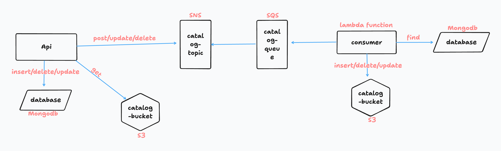

<div align="center">
  <h1>Desafio Anotaai Nodejs</h1>
  
  
  
  
<a href="#description">Description</a>&nbsp;&nbsp;&nbsp;|&nbsp;&nbsp;&nbsp;
<a href="#requirement">Requirement</a>&nbsp;&nbsp;&nbsp;|&nbsp;&nbsp;&nbsp;
<a href="#usage">Usage</a>&nbsp;&nbsp;&nbsp;|&nbsp;&nbsp;&nbsp;
<a href="#resources">Resources</a>

</div>

## Description

Challenge completed for this project [Challenge](https://github.com/githubanotaai/new-test-backend-nodejs)



## Requirement

To this project your need:

- nodejs v20.6.0 [Nodejs](https://nodejs.org/en/download)
- docker [Docker](https://www.docker.com/)
- aws cli v2.15.15 [Cli](https://aws.amazon.com/pt/cli/)

In the _catalog_ folder you need create a file **.env** with the same information describe in **.env.example** and put your configuration there:

In the _.aws-config_ folder you need create a file **lambda_envs.json** with the same information describe in **lambda_envs.example.json** and put your configuration there:

## Usage

Start Docker in your machine and run this commands in your terminal:

```sh
## LAMBDA
## install dependecies lambda
❯ cd lambda && npm i
## build your lambda
❯ cd lambda && npm run build
## create a zip
❯ cd lambda && npm run posbuild

## up docker compose
❯ docker compose up -d

## configure a new aws profile
❯ .aws-config/configure_aws.sh

## create all of aws services
❯ .aws-config/create_aws_service.sh

## CATALOG
## install dependecies catalog
❯ cd catalog && npm i

## run this command to start api(localhost:3000):
❯ npm run local

```

API routes are in the **api** folder

## Resources

- aws lambda
- aws sqs
- aws sns
- aws s3
- nodejs
- typescript
- mongodb
- jest
- express

<div align="center">

Made by Janapc 🤘 [Get in touch!](https://www.linkedin.com/in/janaina-pedrina/)

</div>
